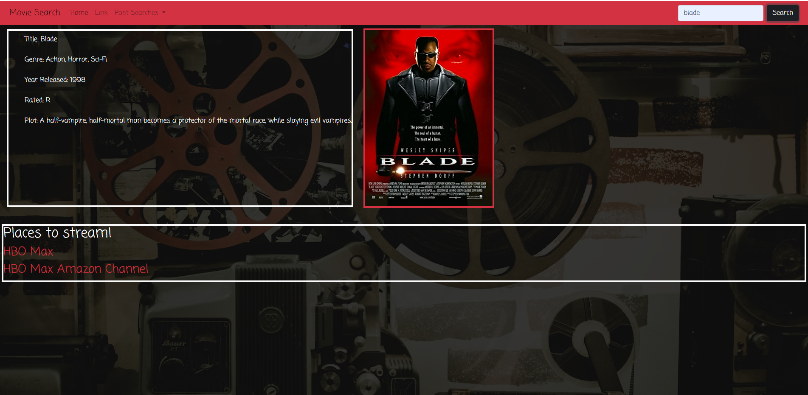

# Movie-Search

## Description

A website where you can search for movie information such as, Title, Year Released, Genre, and Plot. Additionally the site will also auto-generate information on the streaming services that are currently playing the movie. A list of the past searches will be saved using local storage. And a list of movie titles with matching words to your search will be listed as well.
We used the first API to gather the movie poster image and the info that goes in the info box. The second API we used gives us the info about where the movie is streaming.  
Used HTML, CSS, and JavaScript to build the app.

## URL's

[github](https://github.com/JuanMartinez503/Movie-Search-Engine)

[live site](https://juanmartinez503.github.io/Movie-Search-Engine/)

## Screenshot of Project

## Resource and Assistance Credit

https://www.omdbapi.com/?i=tt3896198&apikey=dd2719c9 
https://developers.themoviedb.org/3/movies/get-movie-details 
https://fonts.google.com/specimen/Coming+Soon?query=coming+soon
https://www.amctheatres.com/movie-theatres/evansville/amc-evansville-16  
https://www.digitalocean.com/community/tutorials/how-to-change-a-css-background-images-opacity 
https://getbootstrap.com/docs/5.1/getting-started/introduction/ 
https://code.jquery.com/jquery-3.4.1.min.js
https://cdn.jsdelivr.net/npm/bootstrap@5.1.3/dist/js/bootstrap.bundle.min.js 
https://www.google.com/ 

